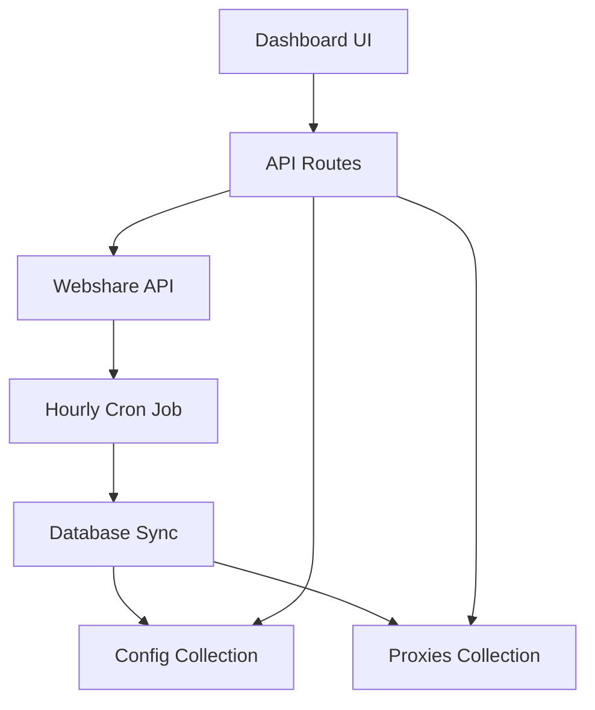

# Webshare Modern Dashboard Implementation Plan
*Date: July 2, 2025*
*Status: Implementation Plan - Ready for Development*

## 📋 **PROJECT OVERVIEW**

Create a comprehensive modern Webshare management dashboard with a tabbed interface featuring:
- Account Information & Analytics
- Proxy Management & Pool
- Settings, Cron Jobs & API Configuration

---

## 🗄️ **DATABASE ARCHITECTURE (2 Collections Only)**

### **Collection 1: `superadmin/webshare/config`**
**Purpose**: Store all account settings, API keys, and configuration data
**Document Structure**:
```typescript
interface WebshareConfig {
  // API Configuration
  apiKey: string;
  isEnabled: boolean;
  testStatus: 'connected' | 'failed' | 'testing' | 'not_tested';
  lastTestError: string | null;
  
  // Account Information (from API)
  profile: {
    id: number;
    email: string;
    username: string;
    first_name: string;
    last_name: string;
    created_at: string;
    last_login: string;
    timezone: string;
    is_verified: boolean;
  };
  
  // Subscription Details (from API)
  subscription: {
    id: string;
    plan_name: string;
    plan_type: string;
    proxy_limit: number;
    bandwidth_limit: number;
    current_usage: {
      proxy_count: number;
      bandwidth_used: number;
      requests_made: number;
    };
    billing: {
      amount: number;
      currency: string;
      billing_cycle: string;
      next_billing_date: string;
      status: string;
    };
    expires_at: string;
    auto_renew: boolean;
  };
  
  // Usage Statistics (from API)
  stats: {
    total_requests: number;
    successful_requests: number;
    failed_requests: number;
    success_rate: number;
    bandwidth_total: number;
    countries_used: Record<string, number>;
    last_30_days: Array<{
      date: string;
      requests: number;
      bandwidth: number;
    }>;
  };
  
  // Cron & Sync Settings
  cronSettings: {
    autoSyncEnabled: boolean;
    syncInterval: number; // minutes
    lastSyncAt: string | null;
    nextSyncAt: string | null;
    statsUpdateInterval: number; // minutes
    lastStatsUpdate: string | null;
  };
  
  // Preferences
  preferences: {
    timezone: string;
    notifications: {
      email: boolean;
      lowBalance: boolean;
      proxyExpiry: boolean;
      syncErrors: boolean;
    };
    dashboard: {
      defaultTab: string;
      refreshInterval: number;
      showAdvancedMetrics: boolean;
    };
  };
  
  // Metadata
  createdAt: string;
  updatedAt: string;
  lastApiSync: string | null;
}
```

### **Collection 2: `superadmin/webshare/proxies`**
**Purpose**: Store all proxy data with comprehensive details
**Document ID Pattern**: `proxy_{webshareId}`
**Document Structure**:
```typescript
interface WebshareProxy {
  // Basic Proxy Info
  id: string;
  webshareId: string;
  username: string;
  password: string;
  proxy_address: string;
  port: number;
  
  // Status & Validation
  valid: boolean;
  last_verification: string;
  verification_status: string;
  uptime_percentage: number;
  
  // Geographic Info
  country_code: string;
  country_name: string;
  city_name: string;
  region: string;
  timezone: string;
  
  // Network Details
  asn_number: string;
  asn_name: string;
  proxy_type: 'datacenter' | 'residential' | 'mobile';
  protocol_support: string[];
  
  // Performance Metrics
  performance: {
    avg_response_time: number;
    success_rate: number;
    total_requests: number;
    successful_requests: number;
    failed_requests: number;
    bandwidth_used: number;
    last_used: string | null;
  };
  
  // Configuration
  config: {
    max_concurrent: number;
    rotation_interval: number;
    sticky_session: number;
    timeout: number;
  };
  
  // Metadata
  created_at: string;
  updated_at: string;
  syncedAt: string;
  isActive: boolean;
  tags: string[];
}
```

---

## 🎨 **UI DESIGN - MODERN TABBED INTERFACE**

### **Tab 1: Account Information**
```tsx
// Components to create:
- AccountOverviewCard: Profile info, verification status
- SubscriptionCard: Plan details, usage, billing
- UsageAnalyticsChart: Request/bandwidth trends
- BillingHistoryTable: Recent transactions
- QuickStatsCards: Success rate, total requests, etc.
```

### **Tab 2: Proxy Management**
```tsx
// Components to create:
- ProxyListTable: Paginated table with filtering/sorting
- ProxyFilters: Country, status, performance filters
- ProxyStatsCards: Total, active, performance metrics
- ProxyBulkActions: Export, refresh, health check
- ProxyDetailsModal: Individual proxy information
```

### **Tab 3: Settings & Configuration**
```tsx
// Components to create:
- APIConfigurationForm: API key management, testing
- CronJobSettings: Sync intervals, scheduling
- NotificationPreferences: Alert settings
- SystemPreferences: Timezone, dashboard settings
- SyncJobHistory: Recent sync operations
```

---

## 🔧 **API ENDPOINTS TO IMPLEMENT**

### **Backend API Routes**
```typescript
// 1. Configuration Management
GET    /api/superadmin/webshare/config
POST   /api/superadmin/webshare/config
PUT    /api/superadmin/webshare/config

// 2. Account Information
GET    /api/superadmin/webshare/account/profile
GET    /api/superadmin/webshare/account/subscription
GET    /api/superadmin/webshare/account/stats

// 3. Proxy Management
GET    /api/superadmin/webshare/proxies
POST   /api/superadmin/webshare/proxies/sync
GET    /api/superadmin/webshare/proxies/stats
POST   /api/superadmin/webshare/proxies/health-check

// 4. System Operations
POST   /api/superadmin/webshare/test-connection
POST   /api/superadmin/webshare/sync-all
GET    /api/superadmin/webshare/sync-jobs
```

### **Webshare API Integration Points**
```typescript
// Account Data
GET /api/v2/profile/
GET /api/v2/subscription/
GET /api/v2/stats/

// Proxy Management
GET /api/v2/proxy/list/
POST /api/v2/proxy/refresh/
GET /api/v2/proxy/config/

// Additional Features
GET /api/v2/ip-authorization/
GET /api/v2/payment/transaction/
```

---

## ⚙️ **CRON JOB IMPLEMENTATION**

### **Hourly Sync Job**
```typescript
// Schedule: Every hour
async function hourlySyncJob() {
  try {
    // 1. Sync proxy list
    await syncProxyList();
    
    // 2. Update account info
    await updateAccountInfo();
    
    // 3. Fetch usage statistics
    await updateUsageStats();
    
    // 4. Update proxy performance metrics
    await updateProxyMetrics();
    
    // 5. Log sync results
    await logSyncResults();
  } catch (error) {
    await handleSyncError(error);
  }
}
```

### **Sync Functions**
```typescript
async function syncProxyList() {
  // Fetch all proxies from Webshare API
  // Update database with new/changed proxies
  // Remove deleted proxies
  // Update performance metrics
}

async function updateAccountInfo() {
  // Fetch profile data
  // Fetch subscription details
  // Update config collection
}

async function updateUsageStats() {
  // Fetch usage statistics
  // Calculate trends and analytics
  // Update config collection
}
```

---

## 📱 **COMPONENT STRUCTURE**

### **Main Dashboard Component**
```tsx
// src/components/superadmin/WebshareModernDashboard.tsx
export default function WebshareModernDashboard() {
  const [activeTab, setActiveTab] = useState('account');
  const [config, setConfig] = useState<WebshareConfig | null>(null);
  const [loading, setLoading] = useState(true);

  return (
    <div className="min-h-screen bg-gray-50">
      {/* Header */}
      <DashboardHeader />
      
      {/* Tab Navigation */}
      <TabNavigation activeTab={activeTab} onTabChange={setActiveTab} />
      
      {/* Tab Content */}
      <div className="container mx-auto px-4 py-6">
        {activeTab === 'account' && <AccountTab config={config} />}
        {activeTab === 'proxies' && <ProxyTab config={config} />}
        {activeTab === 'settings' && <SettingsTab config={config} />}
      </div>
    </div>
  );
}
```

### **Account Information Tab**
```tsx
// src/components/superadmin/webshare/AccountTab.tsx
export function AccountTab({ config }: { config: WebshareConfig }) {
  return (
    <div className="space-y-6">
      <div className="grid grid-cols-1 lg:grid-cols-3 gap-6">
        <AccountOverviewCard profile={config.profile} />
        <SubscriptionCard subscription={config.subscription} />
        <QuickStatsCard stats={config.stats} />
      </div>
      
      <div className="grid grid-cols-1 lg:grid-cols-2 gap-6">
        <UsageAnalyticsChart data={config.stats.last_30_days} />
        <BillingInfoCard billing={config.subscription.billing} />
      </div>
    </div>
  );
}
```

### **Proxy Management Tab**
```tsx
// src/components/superadmin/webshare/ProxyTab.tsx
export function ProxyTab({ config }: { config: WebshareConfig }) {
  const [proxies, setProxies] = useState<WebshareProxy[]>([]);
  const [filters, setFilters] = useState<ProxyFilters>({});

  return (
    <div className="space-y-6">
      <ProxyStatsCards />
      <ProxyFilters filters={filters} onFiltersChange={setFilters} />
      <ProxyListTable proxies={proxies} filters={filters} />
    </div>
  );
}
```

### **Settings & Configuration Tab**
```tsx
// src/components/superadmin/webshare/SettingsTab.tsx
export function SettingsTab({ config }: { config: WebshareConfig }) {
  return (
    <div className="space-y-6">
      <div className="grid grid-cols-1 lg:grid-cols-2 gap-6">
        <APIConfigurationCard config={config} />
        <CronJobSettingsCard cronSettings={config.cronSettings} />
      </div>
      
      <div className="grid grid-cols-1 lg:grid-cols-2 gap-6">
        <NotificationPreferencesCard preferences={config.preferences} />
        <SyncJobHistoryCard />
      </div>
    </div>
  );
}
```

---

## 🚀 **IMPLEMENTATION PHASES**

### **Phase 1: Foundation (Week 1)**
1. Create database collections structure
2. Implement basic API routes
3. Set up main dashboard component with tabs
4. Create configuration management

### **Phase 2: Account Information (Week 2)**
5. Implement account data fetching
6. Create account overview components
7. Add subscription and billing displays
8. Implement usage analytics

### **Phase 3: Proxy Management (Week 3)**
9. Create proxy list components
10. Implement filtering and sorting
11. Add proxy performance metrics
12. Create proxy management actions

### **Phase 4: Settings & Automation (Week 4)**
13. Implement settings forms
14. Create cron job configuration
15. Add notification preferences
16. Implement hourly sync jobs

### **Phase 5: Polish & Testing (Week 5)**
17. Add error handling and loading states
18. Implement responsive design
19. Add comprehensive testing
20. Performance optimization

---

## 📊 **DATA FLOW ARCHITECTURE**



---

## 🎯 **SUCCESS METRICS**

- **Performance**: Page load < 2 seconds
- **Reliability**: 99%+ uptime for sync jobs
- **User Experience**: Intuitive tabbed interface
- **Data Accuracy**: Real-time sync with Webshare API
- **Scalability**: Handle 1000+ proxies efficiently

---

**Status**: 📋 **Plan Complete** - Ready for Implementation
**Next Step**: Begin Phase 1 - Foundation Development
**Priority**: 🔥 **HIGH** - Essential for Auto Price module reliability
